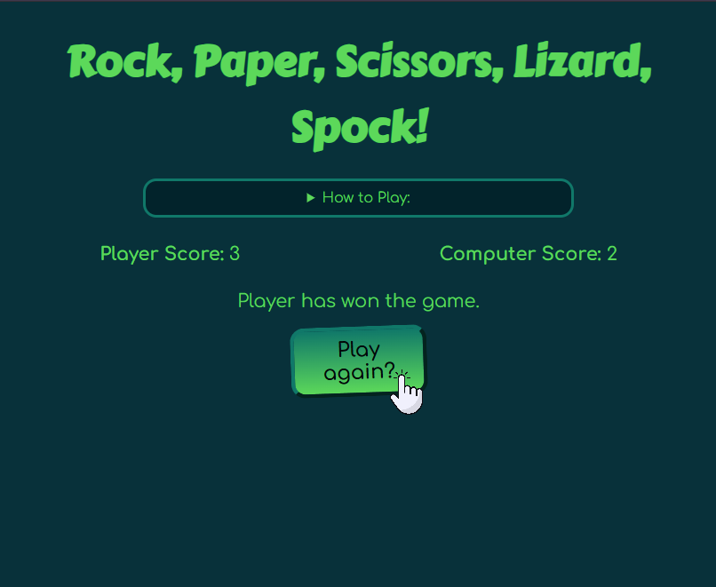
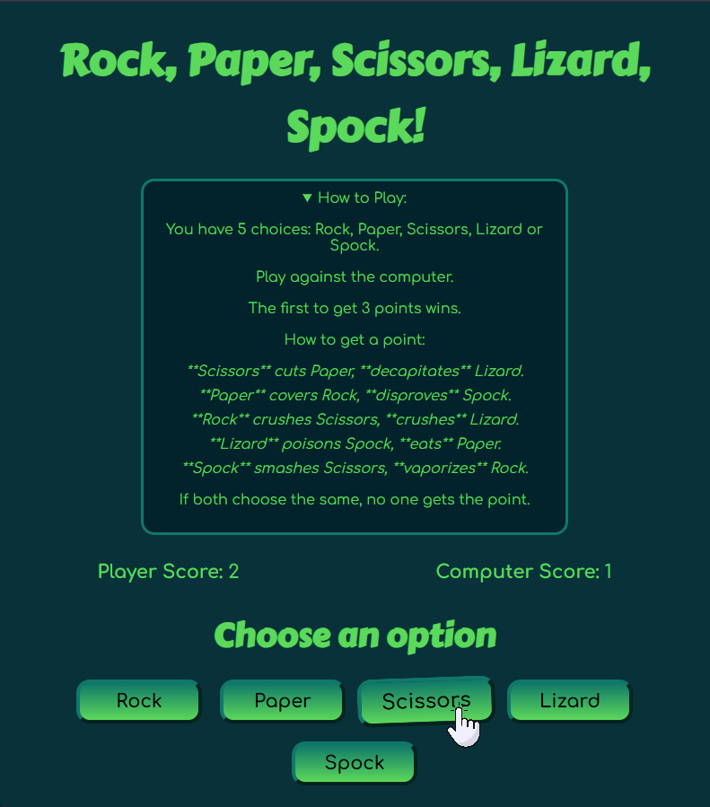

# 🦎🖖 VerdantRPSLS - Rock, Paper, Scissors, Lizard, Spock

An expanded version of the classic game, **Rock, Paper, Scissors, Lizard, Spock (RPSLS)**, built with HTML, CSS, and Vanilla JavaScript. Test your luck and strategy against the computer! BAZINGA!

<table border="0" cellspacing="0" cellpadding="0" style="border: none !important; border-spacing: 0; margin: 0 auto; width: 100%;">
    <tr>
        <td align="center">
            
        </td>
        <td align="center">
            
        </td>
    </tr>
</table>

## 🎯 The Rules of the Game

This game uses the popular five-option variation (RPSLS), where each option defeats two others and is defeated by two others. The first player to reach **3 points** wins the match.

The 10 unique winning conditions are:

1. **Scissors** ✂️ cuts Paper 📜, **decapitates** Lizard 🦎.
2. **Paper** 📜 covers Rock 🗿, **disproves** Spock 🖖.
3. **Rock** 🗿 crushes Scissors ✂️, **crushes** Lizard 🦎.
4. **Lizard** 🦎 poisons Spock 🖖, **eats** Paper 📜.
5. **Spock** 🖖 smashes Scissors ✂️, **vaporizes** Rock 🗿.

## ✨ Features

* **Expanded Gameplay:** Five choices instead of three.
* **Dynamic Scoring:** Real-time score tracking.
* **Verdant Theme:** A signature green/teal color palette, defined using CSS variables.
* **Pure Frontend:** Zero dependencies, easy to run.
* **Responsive Design:** Optimized for both mobile and desktop screens.
* **Reset Functionality:** Easy option to start a new game.

## 🛠️ Technologies Used

* **HTML5** (Structure)
* **CSS3** (Styling)
* **JavaScript (Vanilla JS)** (Game Logic)

## 💡 Running the Application Locally

The application is a purely static frontend project.

1. **Clone the Repository:**

    ```bash
    git clone [Your Repo URL]
    cd VerdantRPSLS
    ```

2. **Launch the Game:**
    Simply open the **`index.html`** file in your web browser (e.g., Chrome, Firefox, Edge).

## 🤝 Contribution

Feel free to open issues to report bugs or suggest new features!

## 📜 License

This project is licensed under the MIT License.

## 🙏 Acknowledgements

* The concept and initial structure for the Rock, Paper, Scissors game were derived from an exercise in "The Complete JavaScript Course 2025: From Zero to Expert!" created by Jonas Schmedtmann.

* The final implementation, including the addition of the Lizard and Spock rules (RPSLS logic) and the UI styling, was executed and customized by the project author.
